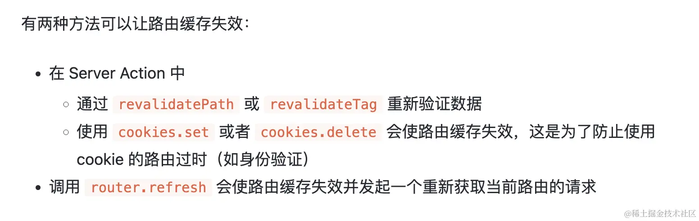

## 项目介绍

基于 `next14`、`prisma`、`mysql` 的 `React Node`

## 项目亮点

- [x] `server action`处理数据，减少`API`层逻辑；`revalidatePath`和`router.refresh`在不同情况下刷新缓存
- [x] `Zod`处理表单数据校验，`useFormState`处理表单信息，`useFormStatus`处理过度状态
- [x] 合理服务端组件和客户端组件拆分，减少`bundle`大小，如`dayjs`包
- [] 高性能的`SSG`国际化，依靠`generateStaticParams`
- [x] [server action](https://github.com/vercel/next.js/tree/canary/examples/server-actions-upload/app)文件上传
- [x] 三套方案：`redis` + `server action` + `sql`； `strapi` + `mysql` + 普通接口请求；`prisma`+`mysql`

